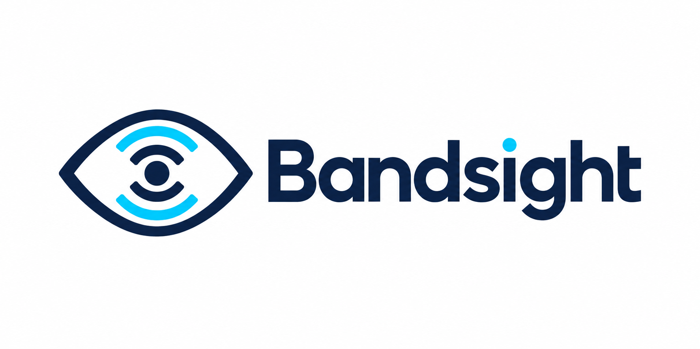

<p align="center">
  <picture>
    <source media="(prefers-color-scheme: dark)" srcset="docs/branding/bandsight-logo-dark.png">
    
  </picture>
</p>

<p align="center"><b>See which apps use your bandwidth on Linux. Always on, kept forever, no packet capture.</b></p>

> [!WARNING]
> **Bandsight is under active development (v0.1.x, pre-1.0).**
> Tested on Ubuntu 26.04, kernel 7.0, KDE Plasma (Wayland), x86_64. Other distros,
> kernels and desktops are built in CI but not yet tested at runtime.
> The SQLite schema and the socket protocol may change between releases.
> The Connections tab and per-host attribution are not implemented yet.

---

## What it is

Bandsight is a network usage monitor for Linux. It has two parts:

- **`bandsightd`**, a small system daemon that starts at boot and counts bytes per
  network interface (from rtnetlink) and per application (from eBPF socket hooks).
  Everything goes into a local SQLite database.
- **`bandsight`**, a Qt6 desktop app that shows live and historical usage: a traffic
  graph, a per-app usage summary, interface totals, a data cap bar and a tray icon
  with live rates.

The daemon is the only part that records. Close the window, quit the app or never
install the GUI at all, and your usage is still being counted.

Bandsight only monitors. It does not block, firewall, capture packets or read
payloads. It counts bytes and writes them down.

## Why it exists

**Inspired by GlassWire.** GlassWire on Windows made one thing easy: open a window,
see what used your data today, this week, this month, per app. Linux has no real
equivalent, so Bandsight is an attempt at that experience, built the Linux way
(systemd service, eBPF, SQLite, Qt).

**Built to fix my own problems with Sniffnet.** Sniffnet is a great traffic
inspector, and I used it. But I wanted to answer "where did my data go this month?",
and Sniffnet is built around live capture sessions, not long term accounting. These
are the things I needed that Sniffnet does not do, and that Bandsight does:

| Need | Sniffnet | Bandsight |
|---|---|---|
| Keep counting when the app is closed | Only sees traffic while the app is running a capture | Daemon counts from boot, GUI optional |
| History across restarts and reboots | Stats belong to the current session | SQLite history with rollups: 1 minute up to 30 days in the graph, daily totals kept forever |
| Monthly data cap with billing cycle | No | Cap, cycle start day, usage bar and end of cycle projection |
| All interfaces at once | One adapter per capture | Every physical and Wi-Fi interface, with per-interface filters |
| Run the viewer without root | Capture needs elevated privileges for the app itself | Only the daemon is privileged; the GUI is a normal user app (member of the `bandsight` group) |
| No packet capture | Captures packets with libpcap | Counts bytes in the kernel with eBPF, never reads packet contents |
| Tray icon with live rates | No | Yes (StatusNotifier) |
| Apps that start and exit quickly | | Caught via exec events; apps already running at daemon start are seeded from `/proc` |

To be fair, Sniffnet has plenty that Bandsight does not: per-host and per-country
views, protocol and service detection, notifications, PCAP import/export and themes.
If you want to inspect traffic, use Sniffnet. If you want to account for it over
time, that is what Bandsight is for.

## Features

- Per-application download and upload totals, attributed in the kernel by eBPF
- Interface totals that match what your ISP sees (physical and Wi-Fi only, so VPN,
  loopback and virtual interfaces are not double counted)
- Traffic graph with 9 windows: 1 min, 5 min, 30 min, 1 h, 6 h, 12 h, 24 h, 7 days, 30 days
- Usage view: total donut with download/upload split, apps ranked by usage, timeline
- Data cap with a billing cycle start day and a projection to the end of the cycle
- Tray icon showing current rates; closing the window hides it to the tray
- Light and dark aware chart colours
- Hardened systemd service (narrow capabilities, `ProtectSystem=strict`, `NoNewPrivileges`)
- Live JSON feed over a Unix socket for your own scripts

## Requirements

- Linux with systemd
- A kernel with BTF enabled (`/sys/kernel/btf/vmlinux` exists). This is the default on
  current Debian, Ubuntu, Fedora, openSUSE and Arch kernels.
- x86_64 or aarch64

Without root (or if the eBPF hooks cannot attach) the daemon still records
interface totals, just not the per-app breakdown, and logs why.

## Install

Download packages from the [Releases](https://github.com/Isuru-rana/bandsight/releases) page.

### Debian / Ubuntu (Debian 12+, Ubuntu 24.04+)

```bash
sudo apt install ./bandsight_*_amd64.deb
```

### Fedora / openSUSE

```bash
sudo dnf install ./bandsight-*.x86_64.rpm        # Fedora
sudo zypper install ./bandsight-*.x86_64.rpm     # openSUSE
```

The `.deb` and `.rpm` packages create the `bandsight` group and enable and start
`bandsightd` for you.

### Arch Linux

A `PKGBUILD` lives in [`packaging/arch/`](packaging/arch/). A prebuilt
`.pkg.tar.zst` is also attached to each release:

```bash
sudo pacman -U bandsight-*.pkg.tar.zst
sudo systemctl enable --now bandsightd
```

### After installing (all distros)

Add yourself to the `bandsight` group, then log out and back in:

```bash
sudo usermod -aG bandsight $USER
```

The GUI reads the daemon's database directly, and the database directory is only
open to that group. Without it the window still opens and tells you the exact
command to run. Then launch **Bandsight** from your app menu, or run `bandsight`.

Anyone in the `bandsight` group can see per-app usage for every process on the
machine, so add users accordingly.

## Build from source

Debian / Ubuntu dependencies:

```bash
sudo apt install build-essential cmake pkg-config libsqlite3-dev libbpf-dev clang bpftool \
    qt6-base-dev libqt6charts6-dev libqt6sql6-sqlite
```

Fedora:

```bash
sudo dnf install gcc-c++ cmake pkgconf-pkg-config sqlite-devel libbpf-devel clang bpftool \
    qt6-qtbase-devel qt6-qtcharts-devel
```

Build and install:

```bash
cmake -B build -DCMAKE_BUILD_TYPE=Release -DCMAKE_INSTALL_PREFIX=/usr
cmake --build build
sudo cmake --install build
sudo groupadd --system bandsight
sudo systemctl daemon-reload
sudo systemctl enable --now bandsightd
```

`bpf/vmlinux.h` is committed, so building does not need BTF on the build machine.
To build only the daemon, pass `-DBANDSIGHT_BUILD_GUI=OFF` (the GUI is also skipped
automatically when Qt6 is missing).

Build your own packages with `cd build && cpack -G DEB` or `cpack -G RPM`.

## Using the data directly

The database is `/var/lib/bandsight/bandsight.db` (SQLite, WAL mode). Per-app totals
for the current month:

```bash
sqlite3 -readonly /var/lib/bandsight/bandsight.db <<'SQL'
SELECT a.name, SUM(s.rx) AS rx_bytes, SUM(s.tx) AS tx_bytes
FROM app_samples s
JOIN apps a ON a.id = s.app_id
JOIN ifaces i ON i.id = s.iface_id
WHERE s.res = 86400
  AND i.kind IN ('physical', 'wifi')
  AND s.ts >= strftime('%s', date('now', 'start of month'))
GROUP BY a.id
ORDER BY rx_bytes + tx_bytes DESC;
SQL
```

The daemon also pushes live updates on `/run/bandsightd/sock`. Server to client frames
are a 4-byte little-endian length followed by JSON: one `hello` frame, then a
`sample` frame about once a second. Client commands are newline-terminated JSON,
for example `{"cmd":"ping"}`.

## Known limitations

1. **Per-app totals read about 5 to 10% below interface totals.** eBPF counts payload
   bytes at the socket layer, the interface counts wire bytes including headers and
   retransmits. GlassWire shows the same gap for the same reason.
2. **No per-host or per-domain view yet.** The eBPF program does not record remote
   addresses today. It is planned.
3. **Kernel updates can break the per-app hooks.** If attach points drift, the daemon
   falls back to interface totals only and logs which hook failed.
4. **The 5 minute view starts empty** after launching the GUI. It is drawn from the
   live feed; longer windows come from history and are complete immediately.
5. **The tray icon needs a StatusNotifier host.** Native on KDE; GNOME needs the
   AppIndicator extension.
6. **No connection list or per-app blocking yet.** Both are on the roadmap.

## Roadmap

- Connections tab (live list of sockets per app)
- Per-host and per-domain attribution
- Per-app blocking (opt-in, after monitoring is solid)
- AUR package

## Contributing

Issues and pull requests are welcome. Please include your distro, kernel version
(`uname -r`) and `journalctl -u bandsightd -b` output with bug reports.

## Licence

GPL-3.0-or-later. See [LICENSE](LICENSE).
